# Android Official Document

### My First App

Ref link :  https://developer.android.com/training/basics/firstapp/building-ui

[Source](./MyFirstApp)

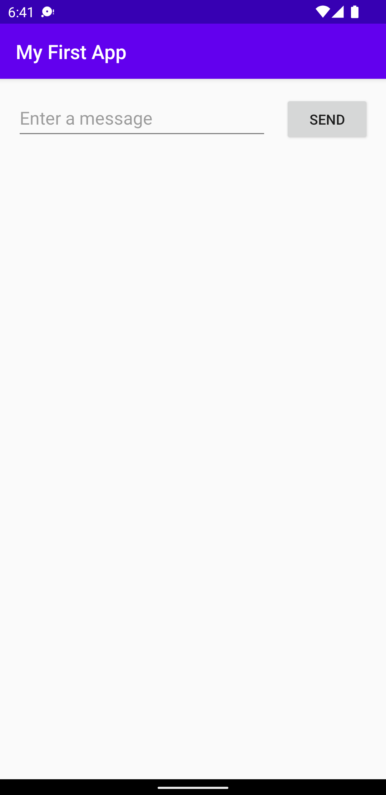 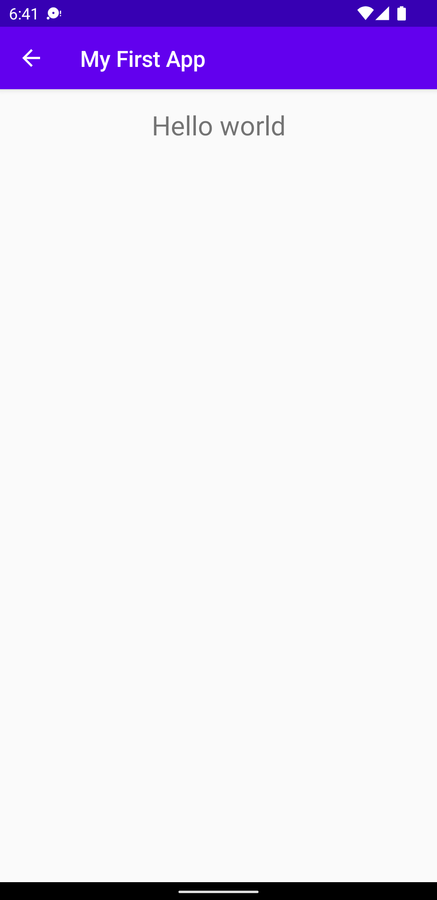

### Codelabs for Android Developer Fundamentals

Ref link : https://developer.android.com/courses/fundamentals-training/toc-v2

##### 1.2 Part A: Your first interactive UI  
[Source](./HelloToast)

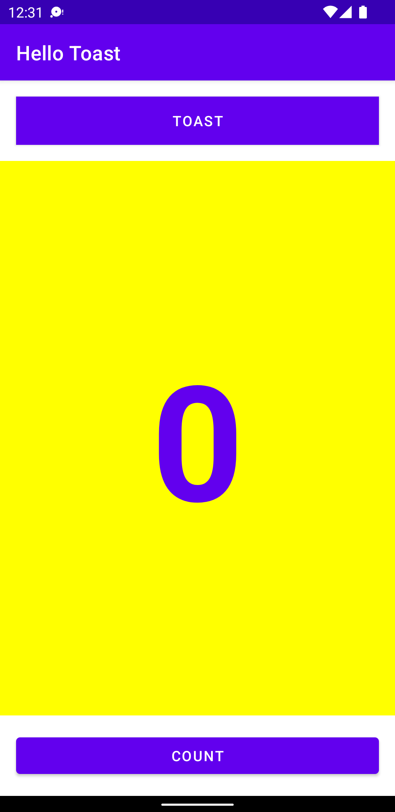

##### 1.2 Part B: The layout editor  
[Source](./HelloConstraint)

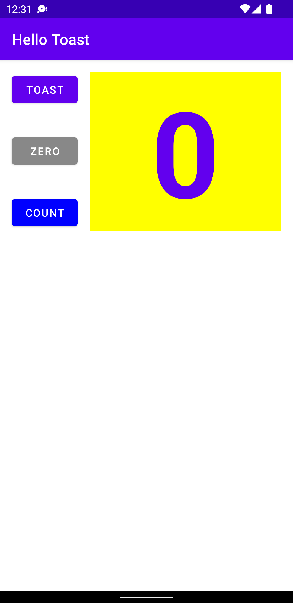 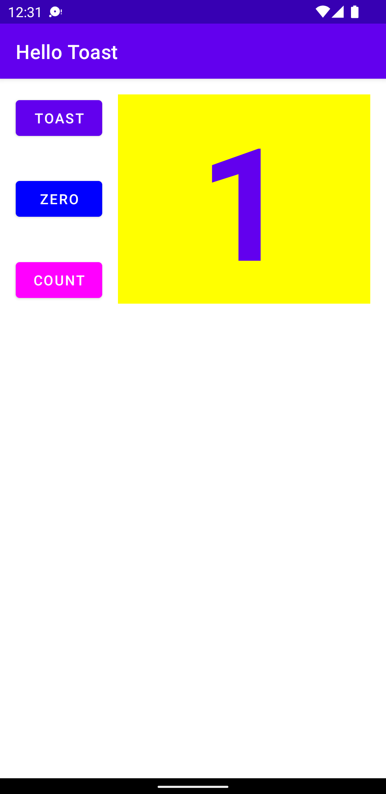

##### 1.3: Text and scrolling views
[Source](./android_fundamentals_01_3)  

 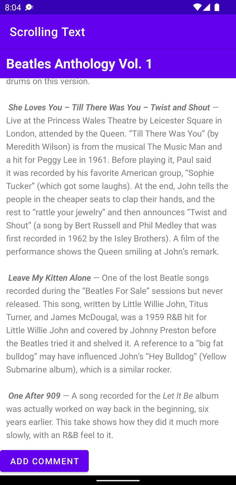

[Homework](./android_fundamentals_01_3)  

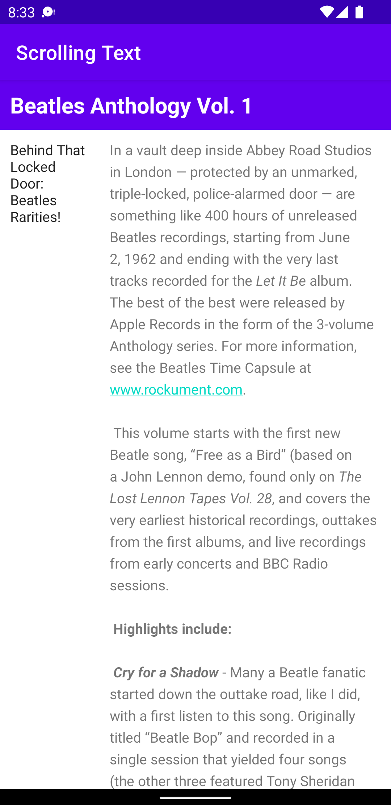

##### 2.1: Activities and intents
[Source](./android_fundamentals_02_1)  

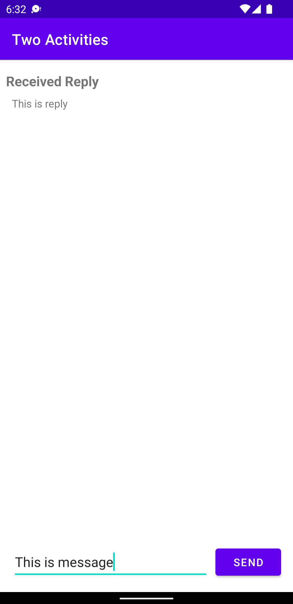 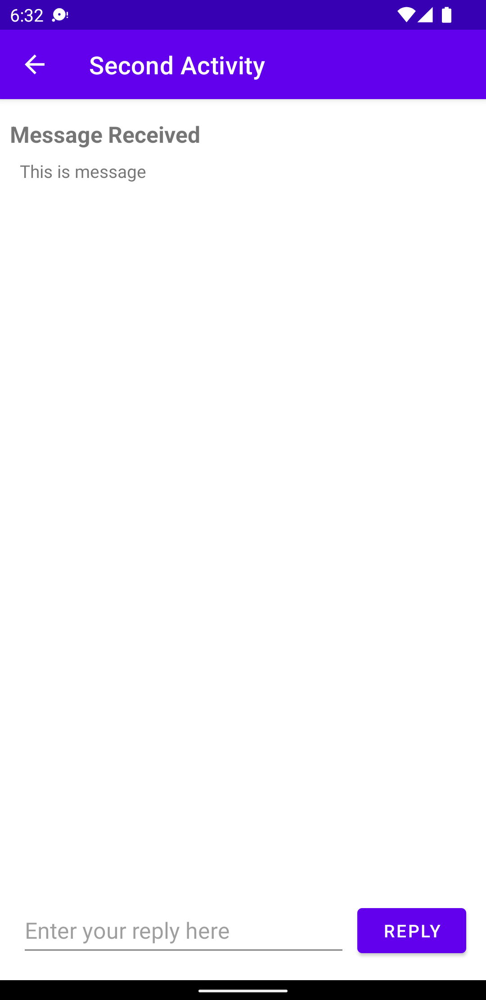

[Homework](./android_fundamentals_02_1_homework)  

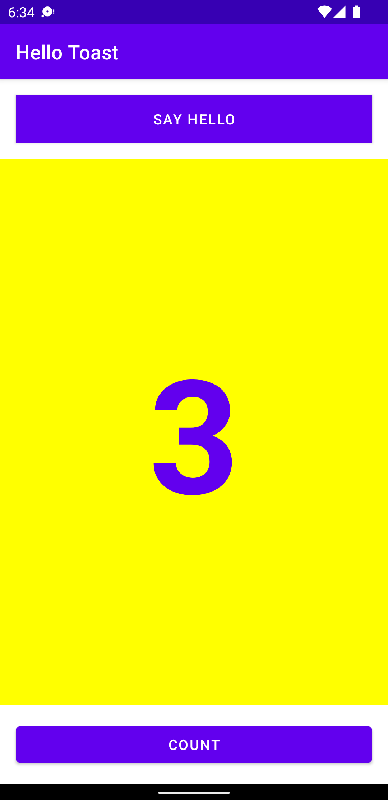 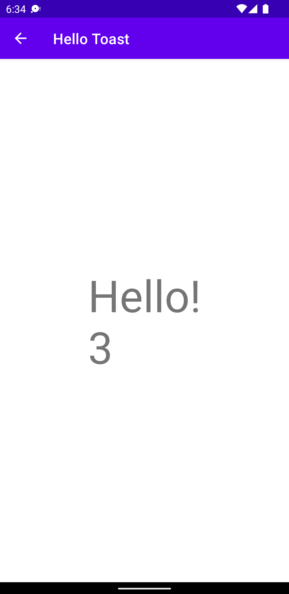
