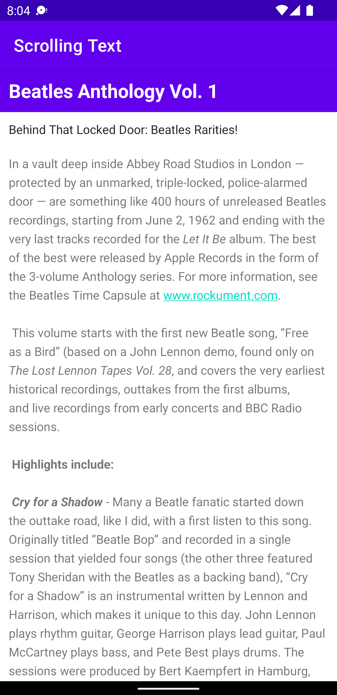

# Android Official Document

### My First App

Ref link :  https://developer.android.com/training/basics/firstapp/building-ui

[Source](./MyFirstApp)

 

### Codelabs for Android Developer Fundamentals

Ref link : https://developer.android.com/courses/fundamentals-training/toc-v2

##### 1.2 Part A: Your first interactive UI  
[Source](./HelloToast)

##### 1.2 Part B: The layout editor  
[Source](./HelloConstraint)

 

##### 1.3: Text and scrolling views
[Source](./android_fundamentals_01_3)  

 

[Homework](./android_fundamentals_01_3)  

##### 2.1: Activities and intents
[Source](./android_fundamentals_02_1)  

 

[Homework](./android_fundamentals_02_1_homework)  

 

##### 2.2: Activity lifecycle and state
[Source](./android_fundamentals_02_2)    

[Challenge](./android_fundamentals_02_2_challenge)  

[Homework](./android_fundamentals_02_2_homework)  

##### 4.1: Clickable images
[Source](./android_fundamentals_04_1)    

[Homework](./android_fundamentals_04_1_homework)   

##### 4.2: Input Controls
[Source](./android_fundamentals_04_2)     

[Homework](./android_fundamentals_04_2_homework)  

##### 4.3: Menus and pickers
[Menu](./android_fundamentals_04_3)     

##### 4.4: User navigation
[Source](./android_fundamentals_04_4)    

##### 4.5: Recycler View
[Source](./android_fundamentals_04_5)  

##### 5.1: Drawables, styles, and themes
[Source](./android_fundamentals_05_1)  

##### 5.2: Cards and colors
[Source](./android_fundamentals_05_2)  

##### 5.3: Adaptive layouts
[Source](./android_fundamentals_05_3)  

##### 7.1: AsyncTask
[Source](./android_fundamentals_07_1)  

##### 7.2: AsyncTask and AsyncTaskLoader
[Source](./android_fundamentals_07_2)  

##### 7.3: Broadcast receivers
[Source](./android_fundamentals_07_3)  

##### 9.1: Shared preferences
[Source](./android_fundamentals_09_1)  
